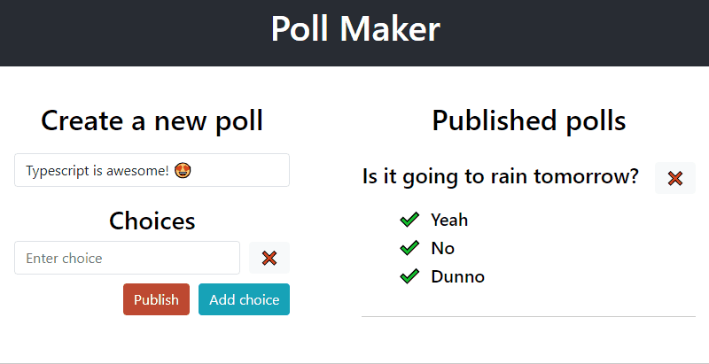

# How to: mobx-state-tree + react + typescript

This is a walkthrough on how to get started with `mobx-state-tree` and connect it to `react` components in a `CRA` app with `typescript`.

The application I built is a simple poll maker that allows to create a new poll, publish it, view and delete published polls. Here is a little demo:

<p align="center">

</p>

The full article is published on [dev.to](https://dev.to/margaretkrutikova/how-to-mobx-state-tree-react-typescript-3d5j).

# Run locally

```shell
yarn
npm run start
```

# Content

- [Setup stores in mobx-state-tree](#setup-stores-in-mobx-state-tree)
  - [Create a base model](#create-a-base-model)
  - [Use composition to create domain stores](#use-composition-to-create-domain-stores)
  - [CRUD on models in a nested list](#crud-on-models-in-a-nested-list)
  - [Convert between models](#convert-between-models)
  - [Root store](#root-store)
  - [Communicate between stores](#communicate-between-stores)
- [Connect react to mobx](#connect-react-to-mobx)
  - [Why not mobx-react](#why-not-mobx-react)
  - [mobx-react-lite to the rescue](#mobx-react-lite-to-the-rescue)
  - [Context provider to pass store](#context-provider-to-pass-store)
  - [Custom hook to inject stores](#custom-hook-to-inject-stores)

## Setup stores in mobx-state-tree

In my poll-maker app there is going to be a base model `PollBase`, a store responsible for creating a new poll `PollDraft`, a model for a published poll `PublishedPoll` and a store for published polls `PublishedPolls`.

### Create a base model

Before we start, install the necessary dependencies:

```
yarn add mobx mobx-state-tree
```

Now let's create a base model for the domain object `poll`, which will have a poll question and a list of choices, and a choice with a string property and id:

```typescript
import { types } from "mobx-state-tree"

const PollChoiceBase = types.model("PollChoiceBase", {
  id: types.identifier,
  value: types.optional(types.string, "")
})

const PollBase = types.model("PollBase", {
  question: "",
  choices: types.optional(types.array(PollChoiceBase), [])
})
```

### Use composition to create domain stores

A poll that is being edited (let's call it a draft poll) and not yet published will have the same properties as `PollBase`, but also actions allowing to edit those properties. Similar, a choice of the draft poll will have the same shape as `PollChoiceBase` with an action to update it:

```typescript
const PollDraftChoice = PollChoiceBase.actions(self => ({
  setChoice(choice: string) {
    self.value = choice
  }))

const PollDraft = types
  .compose(PollBase,
    types.model({
      choices: types.optional(types.array(PollDraftChoice), [])
    })
  )
  .actions(self => ({
    setQuestion(question: string) {
      self.question = question
    }
}))
```

A published poll can no longer be edited, so it won't have editing actions but it needs an extra property `id` to be able to find it or create an external link to it by its id:

```typescript
const PublishedPoll = types.compose(
  PollBase,
  types.model({
    id: types.identifier
  })
)
```

### CRUD on models in a nested list

A draft poll has a list of choices, that can be added, edited and removed. Currently we have an action to update a choice (`setChoice`), but no actions to remove an existing choice or add a new one.

Here is the code (I use [shortid](https://github.com/dylang/shortid) to generate unique ids):

```typescript
import { destroy, getParent, Instance, cast } from "mobx-state-tree"

// Instance is a typescript helper that extracts the type of the model instance
type PollDraftChoiceModel = Instance<typeof PollDraftChoice>
type PollDraftModel = Instance<typeof PollDraft>

const PollDraftChoice = PollChoiceBase.actions(self => ({
  ...
  remove() {
    const pollDraftParent = getParent<PollDraftModel>(self, 2)
    pollDraftParent.removeChoice(cast(self))
  }
}))

const PollDraft = types.compose(...)
  .actions(self => ({
    ...
    addChoice(choice: string) {
      self.choices.push({ id: shortid(), value: choice })
    },
    removeChoice(choiceToRemove: PollDraftChoiceModel) {
      destroy(choiceToRemove)
    }
}))

```

Here is what is happening inside `PollDraftChoice`:

- `getParent<PollDraftModel>(self, 2)` means fetch parent 2 levels up - one until you reach `items` property and one more until you reach `PollDraft` itself, and assume that the returned parent is of type `PollDraftModel`.
- `pollDraftParent.removeChoice(cast(self))` uses [`cast`](https://github.com/mobxjs/mobx-state-tree/blob/master/docs/API/README.md#cast) helper to tell typescript that `self` is indeed of type `PollDraftChoiceModel`. Why is it necessary? The problem is that `self` here is of type what was [before](https://github.com/mobxjs/mobx-state-tree#typing-self-in-actions-and-views) views and actions are applied, which means at that point `self` is actually not of type `PollDraftChoiceModel`, so `pollDraftParent.removeChoice(self)` won't compile in TS.

### Convert between models

Let's create our second domain store to keep track of published polls:

```typescript
import { types, Instance, getSnapshot } from "mobx-state-tree"

type PublishedPollModel = Instance<typeof PublishedPoll>
type PollDraftModel = Instance<typeof PollDraft>

export const PublishedPolls = types
  .model({
    polls: types.optional(types.array(PublishedPoll), [])
  })
  .actions(self => ({
    publishDraft(pollDraft: SnapshotIn<PollDraftModel>) {
      const pollToPublish = { ...pollDraft, id: shortid() }
      self.polls.push(pollToPublish)
    }
  }))
```

Here `publishDraft` takes in a `snapshot` of a poll draft. [Snapshot](https://github.com/mobxjs/mobx-state-tree#snapshots) in `mobx-state-tree` is a plain object stripped from all type information and actions and can be automatically converted to models.

So why does `publishDraft` need to take in a snapshot and not just `PollDraftModel`? That's because an instance of `PollDraftModel` can't be converted to a published poll since it will have extra actions that aren't compatible with `PublishedPollModel`, and will cause a runtime exception. So, by specifying `SnapshotIn<PollDraftModel>` we explicitly say that we want the raw data that exists on `PollDraftModel`.

### Root store

Let's create a root store to combine all stores used in the app: `PollDraft` and `PublishedPolls`:

```typescript
type RootStoreModel = Instance<typeof RootStore>

const RootStore = types.model("RootStore", {
  pollDraft: PollDraft,
  publishedPolls: PublishedPolls
})
```

### Communicate between stores

One way to enable store communication is to make use of `getEnv` function that can inject environment specific data when creating a state tree (from [mobx-state-tree docs](https://github.com/mobxjs/mobx-state-tree#dependency-injection)). So we can just inject a newly created store into the whole state tree. One caveat here is that the environment can't be passed directly into one of the child stores and needs to be passed into the root store.

Here is the code:

```typescript
type RootStoreEnv = {
  publishedPolls: PublishedPollsModel
}

const createStore = (): RootStoreModel => {
  const publishedPolls = PublishedPolls.create()
  const pollDraft = PollDraft.create()

  const env: RootStoreEnv = { publishedPolls }

  return RootStore.create({ pollDraft, publishedPolls }, env)
}
```

Now, `PolLDraft` store can define a `publish` action and call `publishDraft` on `publishedPolls`:

```typescript
import { types, getEnv, getSnapshot } from "mobx-state-tree"

const PollDraft = types
  .compose(...)
  .actions(self => ({
    ...
    publish() {
      const snapshot = getSnapshot(self)

      const env = getEnv<RootStoreEnv>(self)
      env.publishedPolls.publishDraft(snapshot)
    }
  }))

```

### Connect to redux devtools

We will use `connectReduxDevtools` middleware from the package `mst-middlewares` that will connect the state tree to the redux devtools (more info and configuration options available in the [docs](https://github.com/mobxjs/mobx-state-tree/tree/master/packages/mst-middlewares#connectreduxdevtools)). In order to setup the connection we will use a monitoring tool [`remotedev`](https://github.com/zalmoxisus/remotedev). Install the packages first:

```shell
yarn add --dev remotedev mst-middlewares
```

and add the following code after the store creation:

```typescript
import { createStore } from "../stores/createStore"
import { connectReduxDevtools } from "mst-middlewares"

const rootStore = createStore()

connectReduxDevtools(require("remotedev"), rootStore)
```

## Connect react to mobx

### Why NOT mobx-react

The most common way to connect `mobx` to `reaect` is by using [mobx-react](https://github.com/mobxjs/mobx-react) which provides `observer` and `inject` functions, where `observer` is wrapped around components to make them react to changes and re-render and `inject` just injects stores into components. However, I wouldn't recommend using this library because:

- when using `observer`, the component loses the ability to use hooks because it gets converted to a class, more on this [here](https://github.com/mobxjs/mobx-react/issues/594). And the docs recommend in the [best practices](https://mobx.js.org/best/pitfalls.html) to use `observer` around as many components as possible, which means hooks can't be used almost anywhere,
- `inject` function is quite compilcated and doesn't work well with typescript (see [github issue](https://github.com/mobxjs/mobx-react/issues/256#issuecomment-433587230)), requiring all stores to be marked as optional and then using `!` to indicate that they actually exist.

### mobx-react-lite to the rescue

Luckily there is another library, [`mobx-react-lite`](https://github.com/mobxjs/mobx-react-lite), which is built with hooks and provides `observer` wrapper. One thing worth mentioning, `observer` doesn't support classes, but there is a dedicated component `Observer` that can be wrapped around parts of `jsx` in render in class components.

The library provides a lot of hooks like `useObservable`, `useComputed` etc. that are going to be deprecated according to [the docs](https://github.com/mobxjs/mobx-react-lite#notice-of-deprecation). Instead here is a [recommended way](https://github.com/mobxjs/mobx-react/issues/256#issuecomment-433587230), that we are going to follow:

- use `react context` provider to pass down the store(s),
- access the store using `useContext` hook with a selector, alternatively inject the necessary stores with a custom `useInject` hook based on the `useContext` hook,
- wrap components with `observer` from `mobx-react-lite` to subscribe to changes.

First thing, install the library:

```
yarn add mobx-react-lite
```

### Context provider to pass store

First, let's create context `StoreContext`, that will later receive the root store as its `value`, and export provider and a custom hook for accessing the context value:

```typescript
const StoreContext = createContext<RootStoreModel>({} as RootStoreModel)

export const useStore = () => useContext(StoreContext)
export const StoreProvider = StoreContext.Provider
```

And then create the root store with `createStore` and send it into `StoreProvider` which we wrap around `App`:

```JSX
import { StoreProvider } from "./StoreProvider"
import { createStore } from "../stores/createStore"

const rootStore = createStore()

const Root: React.FunctionComponent<{}> = () => (
  <StoreProvider value={rootStore}>
    <App />
  </StoreProvider>
)
```

### Custom hook to inject stores

It is possible to use the `useStore` hook direclty to access the root store and get the necessary data from it, like this:

```typescript
const { pollDraft } = useStore()
```

I would however prefer having a `useInject` hook that takes in a mapping function and returns a mapped object, similar to how it is done in `redux` with `mapStateToProps`. In its simplest form, `useInject` hook might look like this:

```typescript
type MapStore<T> = (store: RootStoreModel) => T

const defaultMapStore: MapStore<RootStoreModel> = store => store

const useInject = <T>(mapStore?: MapStore<T>) => {
  const store = useStore()
  return (mapStore || defaultMapStore)(store)
}
```

The `PollDraft` component would then use `useInject` to access `pollDraft` store from the root store:

```JSX
import { observer } from "mobx-react-lite"
import { RootStoreModel } from "../stores/RootStore"
import useInject from "../hooks/useInject"

const mapStore = (rootStore: RootStoreModel) => ({ pollDraft: rootStore.pollDraft })

const PollDraft: React.FunctionComponent<{}> = observer(() => {
  const { pollDraft } = useInject(mapStore)

  return (
    <div>
      <h1>Create a new poll</h1>
      <input
        value={pollDraft.question}
        onChange={e => pollDraft.setQuestion(e.target.value)}
      />
      <button onClick={pollDraft.publish}>Publish</button>
    </div>
  )
})
```

This is especially useful if `mapStore` function is more compilcated and envolves combining data and actions from several stores.
